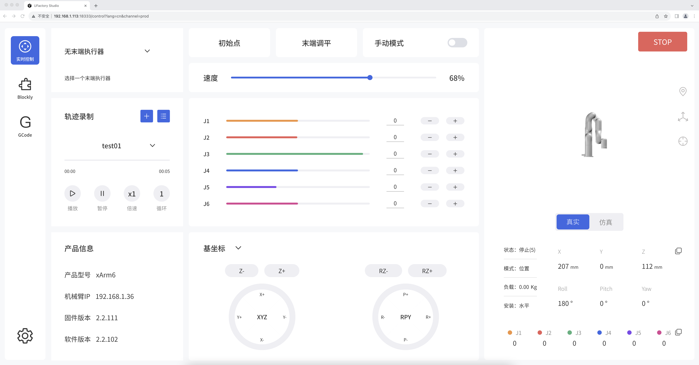

# 软件

## 目录:

* [1.前言](ruan-jian.md#id-1.-qian-yan)
* [2. 连接机械臂](ruan-jian.md#id-2.-lian-jie-ji-xie-bi)
* [3. 实时控制界面](ruan-jian.md#id-3.-shi-shi-kong-zhi-jie-mian)
* [4. Blockly界面](broken-reference)
* [5. Gcode界面](broken-reference)
* [6. 设置界面](broken-reference)
* [7. Blockly典型示例](broken-reference)
* [8. 运动学特性](broken-reference)
* [9. 机械臂状态与模式说明](broken-reference)
* [10. 机械臂运动参数表](broken-reference)
* [11. 术语定义](broken-reference)
* [12. 报错及处理](broken-reference)
* [13. 软件/固件升级方式](broken-reference)

## 1. 前言

  UFACTORY Studio是一个控制机械臂的图形化用户应用程序，可以用来设置机械臂参数，实时控制机械臂姿态，可以通过拖拽Blockly命令来创建机械臂的运动程序。UFACTORY Studio提供了完善的机器人系统状态信息、故障提示与故障处理方案，即使您通过Python SDK/C++/ROS或机械臂自定义TCP协议来创建您的程序，我们仍然建议您在调试、编程阶段，始终保持UFACTORY Studio处于运行状态。   UFACTORY Studio可通过浏览器访问，现已兼容的浏览器有：Google Chrome、Firefox、Safari、Microsoft Edge(Chromium内核)。   适用产品：**xArm5、xArm6、xArm7、UFACTORY 850、Lite6。**

## 2. 连接机械臂

### 2.1 硬件连接

  请参考 硬件

### 2.2 软件连接

  机械臂默认IP为192.168.1.xxx，**请确保电脑IP和机械臂IP处于同一网段，但不能完全一致。即PC端的IPV4网段必须在192.168.1.1-192.168.1.255之间。 如何设置电脑IP请参考**[**快速安装手册-软件连接**](https://www.cn.ufactory.cc/_files/ugd/896670_96742aa662884c389854f66dad3c4cbe.pdf)**。   打开浏览器，在搜索栏中输入‘控制器IP+:18333’**，可快速访问UFACTORY Studio。&#x20;

例如：控制器IP为192.168.1.201&#x20;

访问链接：192.168.1.201:18333 

<figure><figcaption></figcaption></figure>

## 3. 实时控制界面

## 4. Blockly界面

## 5. Gcode界面

## 6. 设置界面

## 7. Blockly典型示例

## 8. 运动学特性

## 9. 机械臂状态与模式说明

  控制器提供7种运动模式和6种状态，对应PythonSDK中\_set\_mode\_, \_set\_state\_函数。

### 9.1 机械臂模式

**模式0：位置控制模式**

控制器启动后默认进入的模式。

**1. 关节运动**

  实现关节空间的点对点运动（单位：度/弧度），每个指令之间速度不连续。&#x20;

示例代码：[set\_servo\_angle](https://github.com/xArm-Developer/xArm-Python-SDK/tree/master/example/wrapper/xarm6) 注意：此例子适用于xArm6，使用xArm5与xArm7请减少或增加对应关节角。

**2. 直线运动**

  实现笛卡尔坐标之间的直线运动（单位：毫米），每个指令之间速度不连续。 可以用Roll/Pitch/Yaw表示机械臂姿态，也可以用轴角Rx/Ry/Rz表示机械臂姿态。&#x20;

示例代码：[set\_position](https://github.com/xArm-Developer/xArm-Python-SDK/blob/master/example/wrapper/common/1001-move_line.py), [set\_position\_aa](https://github.com/xArm-Developer/xArm-Python-SDK/blob/master/example/wrapper/common/1008-move_line_aa.py)

**3. 直线圆弧运动**

  实现笛卡尔坐标之间的直线运动（单位：毫米），在两条直线直接插入圆弧过渡，每个指令之间速度连续。 示例代码：[move\_arc\_lines](https://github.com/xArm-Developer/xArm-Python-SDK/blob/master/example/wrapper/common/1005-move_arc_line.py)

**4. 圆及圆弧运动**

  实现圆弧运动，根据三点坐标计算出空间圆的轨迹，三点坐标分别为（起点、参数1、参数2）。 示例代码：[move\_circle](https://github.com/xArm-Developer/xArm-Python-SDK/blob/master/example/wrapper/common/3001-move_circle.py)

**模式1：伺服模式（servoj）**

此模式对于上位机实时性要求很高，建议使用打了[实时补丁](https://docs.ros.org/en/foxy/Tutorials/Miscellaneous/Building-Realtime-rt_preempt-kernel-for-ROS-2.html)的Linux系统。

**1. 关节伺服模式**

  机械臂可以接受最高以250HZ频率发送的关节位置指令。每收到一条指令机械臂会立刻响应，并以最大速度（180°/s）和加速度执行移动至给定的关节位置，此命令不设置缓冲区，仅执行最新收到的目标点。若发送指令的频率超过250HZ，则多余的指令将会丢失。   目前提供的SDK接口预留了速度、加速度和时间，但目前不起作用。如果客户有能力完成速度、加速度平滑的运动轨迹轨迹并映射到关节空间，servoj模式下可以代替控制器的规划，而令机械臂执行用户自己或第三方（比如ROS Moveit！）的规划算法，**如果用户无法自己实现轨迹规划及运动学逆解，请不要使用此模式。**&#x20;

示例代码：[set\_servo\_angle\_j](https://github.com/xArm-Developer/xArm-Python-SDK/blob/master/example/wrapper/common/7001-servo_j.py)

**2. 笛卡尔伺服模式**

  机械臂可以接受最高以250HZ频率发送的笛卡尔位置指令。每收到一条指令机械臂会立刻响应，并以最大速度和加速度执行移动至给定的笛卡尔位置，此命令不设置缓冲区，仅执行最新收到的目标点。若发送指令的频率超过250HZ，则多余的指令将会丢失。   建议使用方法：以固定的频率（100HZ或200HZ）发布经过插值的平滑轨迹点（两点之间的单步距离不超过10mm），**切勿一次性给出过远的目标位置。**   用户发布指令频率控制在30HZ-250HZ的范围内，若低于30HZ，机械臂运动可能会不连续。使用此模式需要规划每一个轴的精细位置和预测机械臂的运动行为，开发难度很大。&#x20;

示例代码：[set\_servo\_cartesian](https://github.com/xArm-Developer/xArm-Python-SDK/blob/master/example/wrapper/common/7002-servo_cartesian.py) , [set\_servo\_cartesian\_aa](https://github.com/xArm-Developer/xArm-Python-SDK/blob/master/example/wrapper/common/7003-servo_cartesian_aa.py)

**模式2：关节示教模式（手动模式）**

  此模式下，机械臂进入零重力模式，用户可以自由拖动机械臂各连杆完成示教功能。如果拖动示教完成，请切换回模式0。 注意：开启示教模式之前，**务必确认机械臂安装方向和TCP负载设置正确**，否则手臂可能会由于重力补偿不准确而无法自我保持静止！ 示例代码：

```bash
   arm.set_mode(2)
   arm.set_state(0)
```

**模式4：关节速度控制模式**

  指定所有关节目标速度（单位：rad/s），最大关节加速度可通过 _set\_joint\_maxacc_ 设置。&#x20;

示例代码：[vc\_set\_joint\_velocity](https://github.com/xArm-Developer/xArm-Python-SDK/blob/master/example/wrapper/common/2000-joint_velocity_control.py)

**模式5：笛卡尔速度控制模式**

  指定TCP笛卡尔线速度（mm/s）和姿态角速度（rad/s），最大加速度可通过 _set\_tcp\_maxacc_ 设置。

**模式6：关节在线规划模式**

  关节在线轨迹规划（控制器固件版本≥**v1.10.0**），实现关节指令的动态响应。当收到新的运动指令时，立刻当断当前正在进行的关节指令，从当前位置开始规划执行新的关节指令。 示例代码：[set\_servo\_angle](https://github.com/xArm-Developer/xArm-Python-SDK/blob/master/example/wrapper/common/2006-joint_online_trajectory_planning.py)

**模式7：笛卡尔在线规划模式**

  笛卡尔在线轨迹规划（控制器固件版本≥**v1.10.0**），实现笛卡尔指令的动态响应。当收到新的运动指令时，立刻当断当前正在进行的笛卡尔指令，从当前位置开始规划执行新的笛卡尔指令。 注意：使用此模式时，_set\_position\_aa_ 中的`is_tool_coord`必须为False，即**只能以基坐标系为参考**，不能以工具坐标系做相对运动。 示例代码：[set\_position](https://github.com/xArm-Developer/xArm-Python-SDK/blob/master/example/wrapper/common/1010-cartesian_online_trajectory_planning.py)

### 9.2 机械臂状态

**状态0：开启运动**

  **可设置**，手臂准备好运动或运动就绪状态。此状态下，机械臂能正常响应和执行运动指令。设置完成后，状态反馈自动调整为状态2（READY）。如果机械臂从错误、断电或停止状态中恢复，请在发送运动指令前将状态设置为0，否则发送的指令将被丢弃。

**状态1：手臂正在运动中**

  **反馈**。

**状态2：READY**

  **反馈**，手臂已准备好，可以接收执行指令。

**状态3：暂停**

  **可设置可反馈**。

**状态4：停止**

  **可设置可反馈**。 设置：立即停止运动，并清除所有缓存指令。之前发送的指令作废切无法接受新的指令，直至状态被设置回0。 反馈：无法接收新的指令，出现错误码自动跳转为此状态。

**状态5：系统重置**

  **反馈**。指系统设置（比如模式、负载、偏移、灵敏度等）发生了变化，自动跳转为MODE\_CHANGED状态，无法接收执行新的指令，直到收到`set_state(0)`。

**状态6：减速停止**

  **可设置可反馈**。

## 10. 机械臂运动参数表

## 11. 术语定义

控制器：

<figure><figcaption></figcaption></figure>

## 12. 报错及处理

## 13. 软件/固件升级方式
