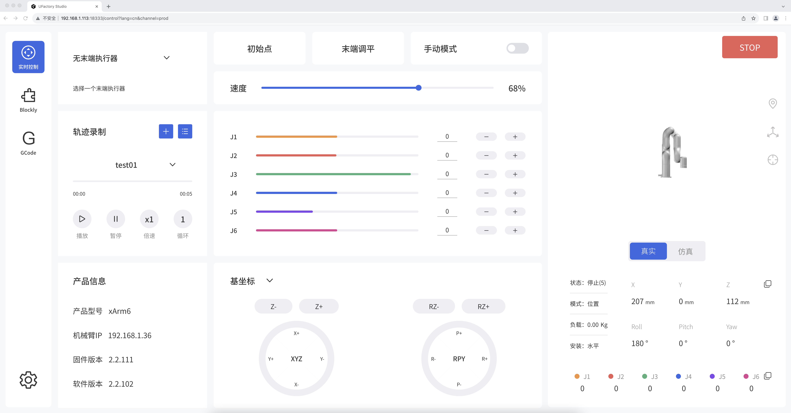

# 目录:  
* [1.前言](#1-前言)
* [2. 连接机械臂](#2-连接机械臂)
* [3. 实时控制界面](#3-实时控制界面)
* [4. Blockly界面](#4-Blockly界面)
* [5. Gcode界面](#5-Gcode界面)
* [6. 设置界面](#6-设置界面)
* [7. Blockly典型示例](#7-Blockly典型示例)
* [8. 运动学特性](#8-运动学特性)
* [9. 机械臂状态与模式说明](#9-机械臂状态与模式说明)
* [10. 机械臂运动参数表](#10-机械臂运动参数表)
* [11. 术语定义](#11-术语定义)
* [12. 报错及处理](#12-报错及处理)
* [13. 软件/固件升级方式](#13-软件/固件升级方式)

# 1. 前言
&ensp;&ensp;UFACTORY Studio是一个控制机械臂的图形化用户应用程序，可以用来设置机械臂参数，实时控制机械臂姿态，可以通过拖拽Blockly命令来创建机械臂的运动程序。UFACTORY Studio提供了完善的机器人系统状态信息、故障提示与故障处理方案，即使您通过Python SDK/C++/ROS或机械臂自定义TCP协议来创建您的程序，我们仍然建议您在调试、编程阶段，始终保持UFACTORY Studio处于运行状态。    

&ensp;&ensp;UFACTORY Studio可通过浏览器访问，现已兼容的浏览器有：Google Chrome、Firefox、Safari、Microsoft Edge(Chromium内核)。   

&ensp;&ensp;适用产品：**xArm5、xArm6、xArm7、UFACTORY 850、Lite6。**
# 2. 连接机械臂
## 2.1 硬件连接
&ensp;&ensp;请参考   硬件
## 2.2 软件连接
&ensp;&ensp;机械臂默认IP为192.168.1.xxx，**请确保电脑IP和机械臂IP处于同一网段，但不能完全一致。**即PC端的IPV4网段必须在192.168.1.1-192.168.1.255之间。
如何设置电脑IP请参考[快速安装手册-软件连接](https://www.cn.ufactory.cc/_files/ugd/896670_96742aa662884c389854f66dad3c4cbe.pdf)。   

&ensp;&ensp;打开浏览器，在搜索栏中输入**‘控制器IP+:18333’**，可快速访问UFACTORY Studio。   

例如：控制器IP为192.168.1.201
访问链接：<u>192.168.1.201:18333</u>



# 3. 实时控制界面

# 4. Blockly界面
# 5. Gcode界面
# 6. 设置界面
# 7. Blockly典型示例
# 8. 运动学特性
# 9. 机械臂状态与模式说明
&ensp;&ensp;控制器提供7种运动模式和6种状态，对应PythonSDK中_set_mode_, _set_state_函数。
## 9.1 机械臂模式
#### 模式0：位置控制模式
控制器启动后默认进入的模式。
##### 1. 关节运动
&ensp;&ensp;实现关节空间的点对点运动（单位：度/弧度），每个指令之间速度不连续。
示例代码：[set_servo_angle](https://github.com/xArm-Developer/xArm-Python-SDK/tree/master/example/wrapper/xarm6)  

注意：此例子适用于xArm6，使用xArm5与xArm7请减少或增加对应关节角。
##### 2. 直线运动
&ensp;&ensp;实现笛卡尔坐标之间的直线运动（单位：毫米），每个指令之间速度不连续。  

可以用Roll/Pitch/Yaw表示机械臂姿态，也可以用轴角Rx/Ry/Rz表示机械臂姿态。
示例代码：[set_position](https://github.com/xArm-Developer/xArm-Python-SDK/blob/master/example/wrapper/common/1001-move_line.py), [set_position_aa](https://github.com/xArm-Developer/xArm-Python-SDK/blob/master/example/wrapper/common/1008-move_line_aa.py)
##### 3. 直线圆弧运动
&ensp;&ensp;实现笛卡尔坐标之间的直线运动（单位：毫米），在两条直线直接插入圆弧过渡，每个指令之间速度连续。  

示例代码：[move_arc_lines](https://github.com/xArm-Developer/xArm-Python-SDK/blob/master/example/wrapper/common/1005-move_arc_line.py)
##### 4. 圆及圆弧运动
&ensp;&ensp;实现圆弧运动，根据三点坐标计算出空间圆的轨迹，三点坐标分别为（起点、参数1、参数2）。  

示例代码：[move_circle](https://github.com/xArm-Developer/xArm-Python-SDK/blob/master/example/wrapper/common/3001-move_circle.py)
#### 模式1：伺服模式（servoj）
此模式对于上位机实时性要求很高，建议使用打了[实时补丁](https://docs.ros.org/en/foxy/Tutorials/Miscellaneous/Building-Realtime-rt_preempt-kernel-for-ROS-2.html)的Linux系统。
##### 1. 关节伺服模式
&ensp;&ensp;机械臂可以接受最高以250HZ频率发送的关节位置指令。每收到一条指令机械臂会立刻响应，并以最大速度（180°/s）和加速度执行移动至给定的关节位置，此命令不设置缓冲区，仅执行最新收到的目标点。若发送指令的频率超过250HZ，则多余的指令将会丢失。  

&ensp;&ensp;目前提供的SDK接口预留了速度、加速度和时间，但目前不起作用。如果客户有能力完成速度、加速度平滑的运动轨迹轨迹并映射到关节空间，servoj模式下可以代替控制器的规划，而令机械臂执行用户自己或第三方（比如ROS Moveit！）的规划算法，**如果用户无法自己实现轨迹规划及运动学逆解，请不要使用此模式。**  

示例代码：[set_servo_angle_j](https://github.com/xArm-Developer/xArm-Python-SDK/blob/master/example/wrapper/common/7001-servo_j.py)
##### 2. 笛卡尔伺服模式
&ensp;&ensp;机械臂可以接受最高以250HZ频率发送的笛卡尔位置指令。每收到一条指令机械臂会立刻响应，并以最大速度和加速度执行移动至给定的笛卡尔位置，此命令不设置缓冲区，仅执行最新收到的目标点。若发送指令的频率超过250HZ，则多余的指令将会丢失。  

&ensp;&ensp;建议使用方法：以固定的频率（100HZ或200HZ）发布经过插值的平滑轨迹点（两点之间的单步距离不超过10mm），**切勿一次性给出过远的目标位置。**
&ensp;&ensp;用户发布指令频率控制在30HZ-250HZ的范围内，若低于30HZ，机械臂运动可能会不连续。使用此模式需要规划每一个轴的精细位置和预测机械臂的运动行为，开发难度很大。  

示例代码：[set_servo_cartesian](https://github.com/xArm-Developer/xArm-Python-SDK/blob/master/example/wrapper/common/7002-servo_cartesian.py) , [set_servo_cartesian_aa](https://github.com/xArm-Developer/xArm-Python-SDK/blob/master/example/wrapper/common/7003-servo_cartesian_aa.py)

#### 模式2：关节示教模式（手动模式）
&ensp;&ensp;此模式下，机械臂进入零重力模式，用户可以自由拖动机械臂各连杆完成示教功能。如果拖动示教完成，请切换回模式0。  

注意：开启示教模式之前，**务必确认机械臂安装方向和TCP负载设置正确**，否则手臂可能会由于重力补偿不准确而无法自我保持静止！  

示例代码：
```bash
   arm.set_mode(2)
   arm.set_state(0)
```
#### 模式4：关节速度控制模式
&ensp;&ensp;指定所有关节目标速度（单位：rad/s），最大关节加速度可通过 _set_joint_maxacc_ 设置。
示例代码：[vc_set_joint_velocity](https://github.com/xArm-Developer/xArm-Python-SDK/blob/master/example/wrapper/common/2000-joint_velocity_control.py)

#### 模式5：笛卡尔速度控制模式
&ensp;&ensp;指定TCP笛卡尔线速度（mm/s）和姿态角速度（rad/s），最大加速度可通过 _set_tcp_maxacc_ 设置。

#### 模式6：关节在线规划模式
&ensp;&ensp;关节在线轨迹规划（控制器固件版本≥**v1.10.0**），实现关节指令的动态响应。当收到新的运动指令时，立刻当断当前正在进行的关节指令，从当前位置开始规划执行新的关节指令。
示例代码：[set_servo_angle](https://github.com/xArm-Developer/xArm-Python-SDK/blob/master/example/wrapper/common/2006-joint_online_trajectory_planning.py)

#### 模式7：笛卡尔在线规划模式
&ensp;&ensp;笛卡尔在线轨迹规划（控制器固件版本≥**v1.10.0**），实现笛卡尔指令的动态响应。当收到新的运动指令时，立刻当断当前正在进行的笛卡尔指令，从当前位置开始规划执行新的笛卡尔指令。  

注意：使用此模式时，_set_position_aa_ 中的`is_tool_coord`必须为False，即**只能以基坐标系为参考**，不能以工具坐标系做相对运动。
示例代码：[set_position](https://github.com/xArm-Developer/xArm-Python-SDK/blob/master/example/wrapper/common/1010-cartesian_online_trajectory_planning.py)

## 9.2 机械臂状态
#### 状态0：开启运动
&ensp;&ensp;**可设置**，手臂准备好运动或运动就绪状态。此状态下，机械臂能正常响应和执行运动指令。设置完成后，状态反馈自动调整为状态2（READY）。如果机械臂从错误、断电或停止状态中恢复，请在发送运动指令前将状态设置为0，否则发送的指令将被丢弃。
#### 状态1：手臂正在运动中
&ensp;&ensp;**反馈**。
#### 状态2：READY
&ensp;&ensp;**反馈**，手臂已准备好，可以接收执行指令。
#### 状态3：暂停
&ensp;&ensp;**可设置可反馈**。
#### 状态4：停止
&ensp;&ensp;**可设置可反馈**。
设置：立即停止运动，并清除所有缓存指令。之前发送的指令作废切无法接受新的指令，直至状态被设置回0。
反馈：无法接收新的指令，出现错误码自动跳转为此状态。
#### 状态5：系统重置
&ensp;&ensp;**反馈**。指系统设置（比如模式、负载、偏移、灵敏度等）发生了变化，自动跳转为MODE_CHANGED状态，无法接收执行新的指令，直到收到`set_state(0)`。
#### 状态6：减速停止
&ensp;&ensp;**可设置可反馈**。

# 10. 机械臂运动参数表

# 11. 术语定义
控制器：
![[livecontrol_traj.png]]
# 12. 报错及处理
![[settings-checkupdate.png]](./pics/settings-checkupdate.png)


# 13. 软件/固件升级方式
